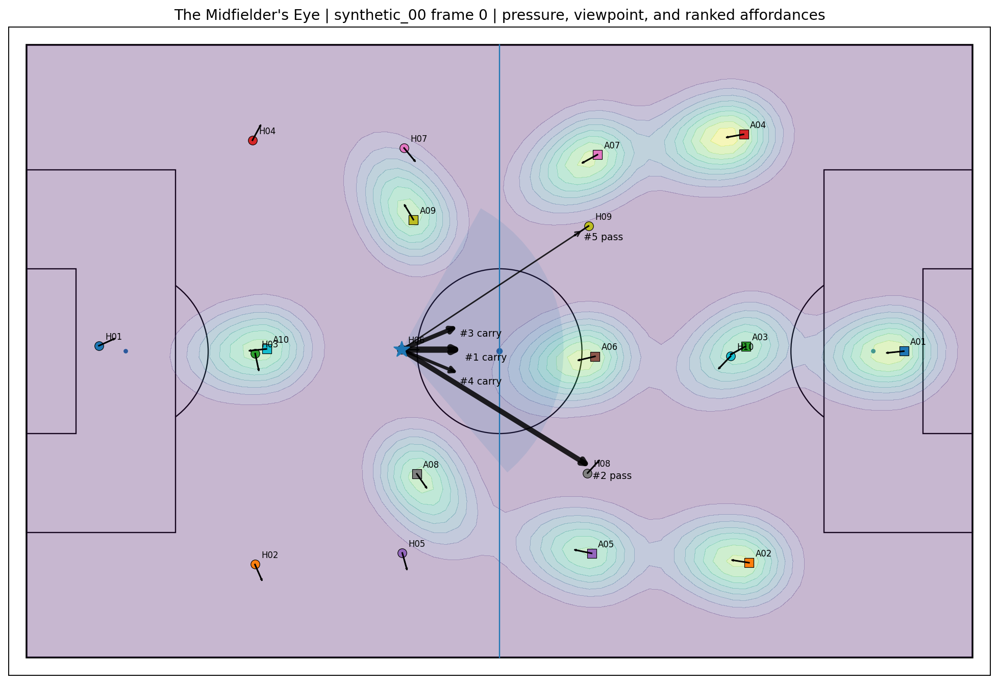
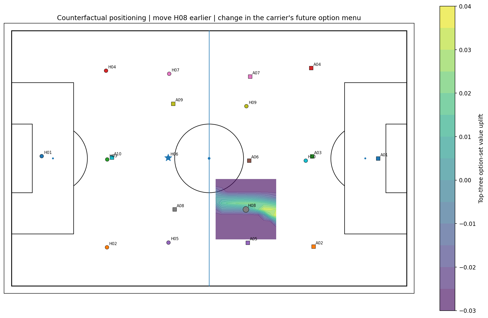

# The Midfielder's Eye ⚽👁️🔬

**Watch an option appear, persist, and get selected (or not) — without treating the selected action as the whole decision.**

Most analytics ask: *which pass was chosen?*  
This project asks a harder question: *what was the changing action menu a midfielder could actually use?*

```text
                    ┌ physical availability
                    ├ perceptual accessibility
state → ACTION MENU ├ tactical value
                    ├ option creation
                    └ eventual selection
```

The selected action is one observed outcome. It is not treated as the full action set.

<p align="center">
  
</p>

<p align="center">
  
</p>

**Core instruments (v0.7)**
- **Action Menu Ribbon** — each row is a stable candidate identity across synchronized frames; click a cell to seek the pitch and candidate.
- **Decision Microscope** — distinguishes absent vs low-scoring, model score vs observed selection, retrospective lifecycle vs causal inputs, and evidence provenance (synthetic / proxy / reconstructed / provider-observed / measured).
- **Frozen Action Menu Benchmark** — separate labels for availability, visibility, value, creation, selection, and confidence, with outcome blinding and sequence-held-out evaluation.

> **Current claim boundary**  
> v0.7 ships the *benchmark contract, software, and visual instrument*. It does **not** claim empirical superiority of dynamic geometry or viewpoint conditioning. Real expert-annotated pilot results (R1) are the publication gate.

---

## 20-second understanding

1. A possession unfolds on a synchronized pitch.
2. Candidate actions (pass / carry / hold) are tracked with *stable identities* across frames.
3. You see options **born**, **persist**, **re-order**, and **extinguish** — independent of which one was eventually selected.
4. You can inspect what the model scored, what was selected, and how confident the evidence is.

That is the Decision Microscope.

---

## Quick start (software verification)

```bash
python -m venv .venv
source .venv/bin/activate          # Windows: .venv\Scripts\activate
pip install -e ".[dev,showcase]"
pytest
midfielders-eye demo
midfielders-eye showcase-build
midfielders-eye showcase-serve
```

- API docs: http://127.0.0.1:8000/docs  
- Frontend (after `cd frontend && npm install && npm run dev`): http://127.0.0.1:5173

**One-command paths (via Makefile)**

```bash
make install
make verify            # tests + demos
make showcase          # build Evidence Studio bundle
make showcase-serve
make frontend-dev      # build showcase then start Vite
make r1-sw-validate    # full R1 *software* path (no empirical claim)
make empirical-build   # real-source empirical showcase
make package-demo      # static site bundle for Pages-style hosting
```

> **Showcase friction note**  
> Generated `artifacts/` are intentionally *not* tracked in Git (large, regenerable). After a clean clone you must run `midfielders-eye showcase-build` (or `make showcase`) before the full interactive studio has data. This keeps the repository lean and reproducible. See `docs/SHOWCASE_AND_DEMO.md`.

---

## R1 Real Action Menu Pilot (status)

The immediate scientific path is the **R1 real-action-menu pilot**:

- Deterministic 10-sequence sampler with diversity mix and causal context
- Score-free, outcome-blind double-rating packs
- Full reliability → adjudication → consensus → causal-feature contract → immutable freeze → benchmark
- Research cockpit at `/pilot` that refuses to invent metrics before evidence files exist

**Docs**
- `docs/R1_REAL_ACTION_MENU_PILOT.md` — full scientific runbook
- `docs/R1_EXECUTION_CHECKLIST.md` — operational checklist (software + real Tier A)
- `docs/ACTION_MENU_BENCHMARK.md` — frozen Paper 1 contract

**Status surface (keep this honest):**
- Annotation ontology and software: **ready**
- Real expert-annotated pilot results: **not yet published** (this is the gate)
- Synthetic + compact real excerpts (Metrica, StatsBomb Pedri 360): **included for software & visualization tests**
- Software-only path: `make r1-sw-validate` → writes `CLAIM_BOUNDARY.json` with `empirical_claim_allowed: false`

---

## What v0.7 adds

### Action Menu Benchmark
- Frozen `configs/action_menu_annotation_v1.yaml` contract
- Separate availability, visibility, value, creation, selection, confidence labels
- Explicit outcome blinding before selection is joined from events
- Sequence-level sampling; no adjacent-frame random splits
- Stable option identities (`pass:<receiver>`, `carry:<angle_bucket>`, `hold`)
- Retrospective lifecycle analytics (birth / persistence / extinction / top-k stability)
- Causal guardrails: future lifecycle labels are *never* model features at the focal frame

### Decision Microscope
The React Evidence Studio includes an **Action Menu Ribbon** in every scenario laboratory. Clicking a ribbon cell seeks the pitch to that exact frame and candidate while preserving evidence provenance and URL state.

### Release robustness
- Single package version authority drives FastAPI, OpenAPI, health, and showcase manifest
- Versioned integration + component contracts require Decision Microscope semantics
- CI covers backend, frontend, contracts, build, and browser gates

---

## Core system

```text
rights-cleared video / provider tracking / manual annotation
                         │
                         ▼
                  canonical game state
                         │
        ┌────────────────┼────────────────┐
        ▼                ▼                ▼
  gaze and view      body mechanics   relational control
        │                │                │
        └────────────────┼────────────────┘
                         ▼
              dynamic affordance field
                         │
              pass / carry / hold menu
                         │
        ┌────────────────┼────────────────┐
        ▼                ▼                ▼
   current value     future options   counterfactuals
                         │
                         ▼
              Action Menu Ribbon
              / Decision Microscope
```

## Benchmark ladder (fail-closed)

```text
B0 naive
  ↓
B1 static geometry
  ↓
B2 dynamic geometry
  ↓
B2-V viewpoint / visibility conditioned
  ↓
B3 learned nonlinear tabular ranker
```

B4 temporal graphs and B5 representation fusion remain **blocked** until expert-label reliability and transfer gates are satisfied.

Primary metrics: NDCG@3, Recall@3, pairwise ranking accuracy, adjacent-frame top-k stability, sequence-bootstrap CIs, provider/match-held-out evaluation where supported.

Null and negative contrasts are retained. Publishing ladder results requires a completed real pilot — see `docs/R1_EXECUTION_CHECKLIST.md` §C.

---

## Frontend routes

```text
/                         narrative landing page
/atlas                    filterable 100-player atlas
/players/:playerId        player research profile
/players/:playerId/perception
/empirical                source-pinned evidence studio
/empirical/experiments/:experimentId
/gaze-lab                 gaze source, scans, fields of view
/body-mechanics           receiving posture and execution envelope
/orchestration            teammate/opponent relational control
/scenario/:scenarioId     flagship Decision Microscope + tactical laboratory
/perception-lab           oracle versus degraded state
/method                   model and evidence explanation
/data-and-rights          provenance and media policy
/pilot                    R1 research cockpit
```

Coach/player simplified views (product layer sketches): `docs/COACH_AND_PLAYER_VIEWS.md`.

## Featured illustrative studies

- Michael Olise: pause, defender commitment, weak-side access
- Rodri: pre-reception scanning, open-body exits, rest-defense control
- Pedri: blind-side arrival, third-player timing, scan-to-action connection
- Aitana Bonmatí: overload, escape, late arrival, collective response
- Vitinha: support-angle creation and circulation-to-penetration
- Jamal Musiala: contact balance, pressure attraction, release after collapse
- Alexia Putellas: vacating and reoccupying central creation lanes
- Yui Hasegawa: micro-positioning and repeated support-angle renewal

All named-player scenarios are **illustrative synthetic reconstructions**, not measured performances. Real excerpts (Metrica tracking, StatsBomb Pedri 360) are included for software and visualization tests only. Expansion rules: `docs/EMPIRICAL_EXPANSION.md`.

---

## Demo & visualization assets

Short GIFs / clips should live under `docs/assets/` (see checklist in `docs/SHOWCASE_AND_DEMO.md`):

1. Action Menu Ribbon + click-to-seek on a possession
2. Option lifecycle (birth → persistence → selection / extinction)
3. B1 vs B2 ranking contrast on the same sequence

**Hosted demo path**
- Codespaces: `.devcontainer/` → `make frontend-dev`
- Static package: `make package-demo` → deploy `artifacts/static-demo/` (GitHub Pages / Cloudflare Pages)

---

## Research goal

The strongest scientific target is not “predict which pass a player chose.” It is:

> Estimate the action menu a player could perceive, the body states from which those actions were executable, and the way movement changed the future options of teammates and opponents.

Paper 1 narrows this to a testable first question: can the action menu itself be annotated reliably and modeled better than static geometry *without collapsing selected action into available action*?

See `docs/PROJECT_GOALS.md`, `docs/ACTION_MENU_BENCHMARK.md`, and `docs/R1_REAL_ACTION_MENU_PILOT.md`.

---

## Media policy

Two lanes only:
1. Rights-cleared local media for frame extraction and model analysis
2. YouTube embed-only references via the official API (never downloaded, never eligible for pixel analysis)

See `docs/MEDIA_INGESTION_AND_RIGHTS.md`.

## License

MIT for this repository. External data, footage, model weights, and upstream perception systems retain their own licenses and access conditions.
